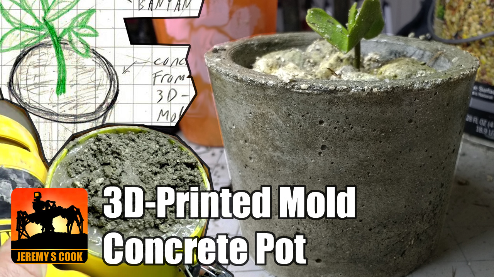

### [Build video](https://www.youtube.com/watch?v=topiOl9TmHY)

# Items Used:

XTC-3D coating: [Amazon](https://amzn.to/34OBsQF)  
Clear PLA filament: [Amazon](https://amzn.to/3aMsUgD)  
Yellow PLA filament: [Amazon](https://amzn.to/36oXgCA)  
Concrete (generic)  
Optional aggregate strainer in root directory.

Note that links to Amazon are affiliate, meaning that I
receive a small % of purchases at no additional cost to you.
